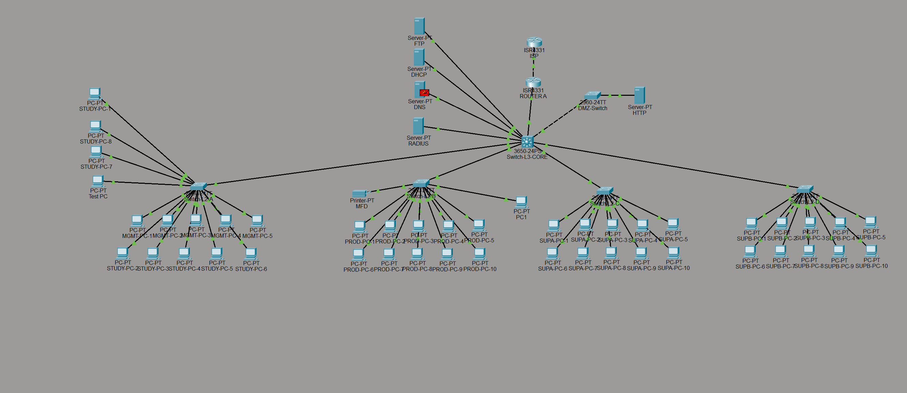
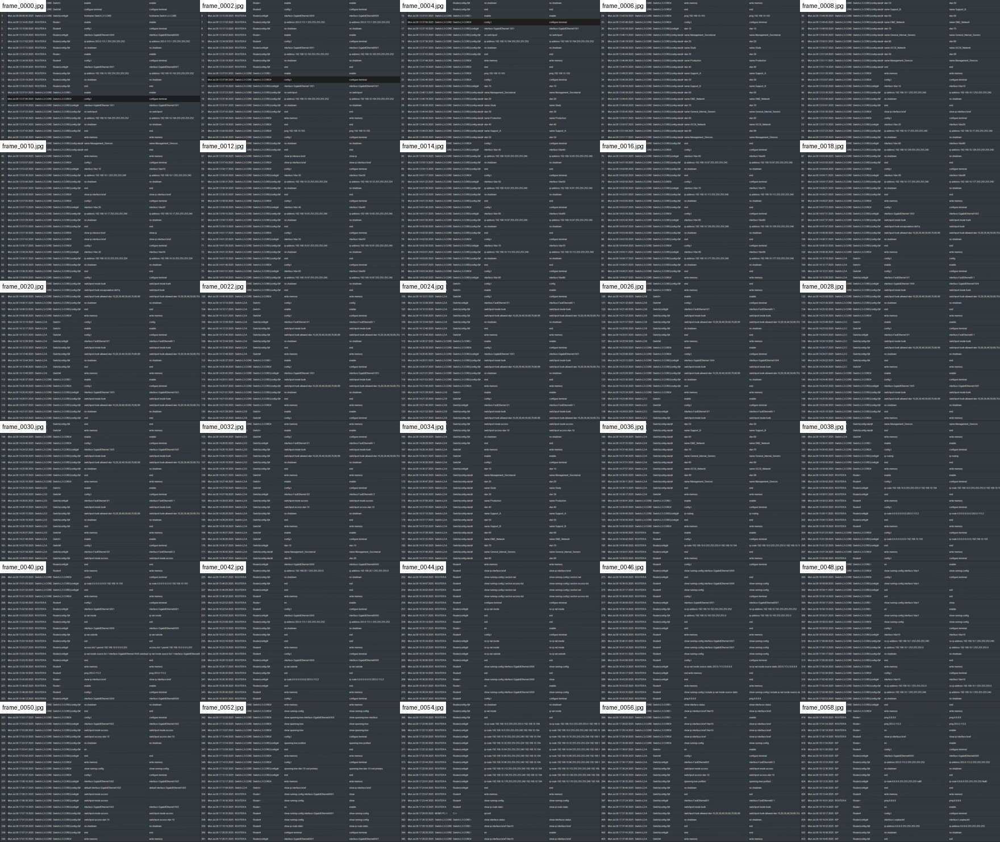

# 🛡️ Final Security Audit Report - Phase 2 Packet Tracer Network

<strong>Overall posture: Moderate risk / acceptable for a lab, not production-ready</strong>

## 📌 Report Banner

| Field | Details |
| --- | --- |
| Project | Phase 2 Packet Tracer network security and compliance review |
| Auditor | Max |
| Main evidence | `Network Design Main final version.pkt`, `viewable logical topology.png`, `Screen_Recording_2026-04-22_Command_Log.md`, `video_ocr_112214_cmd_raw.txt`, `Phase_2_Packet_Tracer_Network_Report.md` |
| Review focus | VLANs, routing, NAT, ACLs, DMZ, servers, management access, authentication, monitoring, resilience, and compliance posture |
| Important limitation | Some command evidence was reconstructed from Packet Tracer screen recordings and OCR. The final `.pkt` running configuration should be checked before final submission. |

## 🧭 Executive Summary

The reviewed Packet Tracer network uses a central Layer 3 core switch, an edge router, several Layer 2 access switches, a DMZ switch, internal services, storage, and separated user VLANs. The strongest design choice is segmentation: users, servers, storage, network management, and the DMZ are separated into different VLANs and controlled with ACLs.

From a security perspective, the design demonstrates a good learning-level defense-in-depth approach. VLAN separation, DMZ isolation, port security, SSH management, logging, NTP, NAT, and ACLs are all present. These controls reduce attack surface and support the confidentiality, integrity, and availability goals expected in a regulated environment.

The most important weaknesses are resilience and privileged access. The network depends heavily on one Layer 3 core switch and one edge router. Weak lab passwords are visible in the command evidence, and RADIUS/AAA is only partly demonstrated because Packet Tracer cannot fully prove enterprise authentication. Some ACL rules are also broader than a strict least-privilege policy should allow.

### 🚨 Top 5 Risks

| Priority | Risk | Severity | Why leadership should care |
| ---: | --- | --- | --- |
| 1 | Single Layer 3 core switch | <strong>High</strong> | One device failure can stop inter-VLAN routing and break access to key services. |
| 2 | Single edge router | <strong>High</strong> | Internet, NAT, and external DMZ access depend on one device. |
| 3 | Weak demo credentials | <strong>High</strong> | Passwords such as `cisco`, `admin`, and `cisco123` are trivial to guess in a real attack. |
| 4 | RADIUS/AAA not fully proven | <strong>High</strong> | Centralized identity and accountability are not demonstrated end to end. |
| 5 | Broad ACL permits | <strong>Medium</strong> | Overly broad rules can allow unnecessary lateral movement. |

## 🔍 Scope And Methodology

This was a configuration and design review, not an exploitation-based penetration test. The review checked whether the Packet Tracer network shows reasonable security architecture and whether the findings can be defended against known frameworks and standards.

Evidence used:

- Packet Tracer design file: `Network Design Main final version.pkt`
- Logical topology image: `viewable logical topology.png`
- Command recording log: `Screen_Recording_2026-04-22_Command_Log.md`
- OCR command reconstruction: `video_ocr_112214_cmd_raw.txt`
- Supporting network report: `Phase_2_Packet_Tracer_Network_Report.md`

Review method:

1. Identify assets, VLANs, subnets, gateways, and trust boundaries.
2. Review routing, NAT, and ACL intent.
3. Review management access, local users, password controls, SSH, and AAA.
4. Review DMZ placement and internet exposure.
5. Review logging, NTP, monitoring, and resilience.
6. Map risks to CIS Benchmarks, NIST SP 800-53, NIST CSF 2.0, MITRE ATT&CK, CCB CyFun, NIS2, and GDPR where relevant.

## 🎚️ Risk Rating Method

| Rating | Criteria |
| --- | --- |
| <strong>High</strong> | A weakness that can directly cause compromise, major outage, unauthorized privileged access, or serious compliance failure. |
| <strong>Medium</strong> | A weakness that increases attack path, weakens least privilege, reduces detection, or creates operational risk but requires extra conditions to become critical. |
| <strong>Low</strong> | A documentation, hardening, or improvement issue that should be fixed but does not immediately create a major risk. |
| <strong>Positive</strong> | A control that reduces risk and should be kept or improved. |

## 📚 Frameworks And Benchmarks Used

| Resource | Used for |
| --- | --- |
| CIS Benchmarks | Device hardening, secure management, password and service baseline expectations. |
| NIST SP 800-53 Rev. 5 | Access control, identification/authentication, audit logging, system communications protection, contingency planning. |
| NIST Cybersecurity Framework 2.0 | Governance, identify, protect, detect, respond, and recover mapping. |
| MITRE ATT&CK | Threat-linking findings such as brute force, valid accounts, lateral movement, and network service discovery. |
| CCB CyberFundamentals Framework | Belgian practical control baseline for NIS2-style security posture. |
| Microsoft Defender for Identity documentation | Useful reference for AD/identity attack patterns such as credential abuse and lateral movement. |
| NIS2 / Belgian NIS2 law | Risk management, incident handling, business continuity, supply chain and management accountability context. |
| GDPR Article 32 | Security of processing where personal data may travel through the network. |

## 🏗️ Main Network Design

| Area | Observed setting | Security purpose |
| --- | --- | --- |
| Core routing | `Switch-L3-CORE` performs inter-VLAN routing using SVIs | Central gateway and segmentation enforcement point |
| Internet edge | `ROUTER A` connects internal network to simulated ISP | Internet routing, NAT, and external filtering |
| DMZ | VLAN 60 with HTTP server `192.168.10.195` | Separates public-facing service from internal users |
| Internal servers | VLAN 70 | DNS, DHCP, RADIUS, logging, and time services |
| Storage | VLAN 80 | Isolates FTP/storage service |
| Network management | VLAN 99 | Keeps switch and device management separate from user VLANs |
| Access layer | Port security, PortFast, trunk restrictions | Reduces basic Layer 2 misuse |

## 🖥️ Device Inventory

| Device | Important IP / interface evidence | Role |
| --- | --- | --- |
| `Switch-L3-CORE` | `Vlan10 192.168.10.1/27`, `Vlan20 192.168.10.33/27`, `Vlan30 192.168.10.65/27`, `Vlan40 192.168.10.97/27`, `Vlan60 192.168.10.193/27`, `Vlan70 192.168.10.129/27`, `Vlan80 192.168.10.225/29`, `Vlan99 192.168.10.161/27`, routed link `G1/0/1 192.168.10.250/30` | Main routing switch and VLAN gateway |
| `ROUTER A` | Outside `G0/0/0 10.0.0.1/30`, inside `G0/0/1 192.168.10.249/30`, default route to `10.0.0.2` | Edge router, NAT, internet route |
| `ISP` | Simulated upstream network using `10.0.0.2`; earlier tests used `203.0.113.2/30` and loopback `8.8.8.8/32` | Internet simulation |
| `Switch-L2-A` | Management IP `192.168.10.163/27`, gateway `192.168.10.161`, trunk allows VLANs `10,20,99` | User access switch |
| `Switch-L2-B` | Management IP `192.168.10.164/27`, gateway `192.168.10.161`, trunk allows VLANs `10,20,99` | User access switch |
| `Switch-L2-C` | Access/trunk switch for Support A side | User access switch |
| `Switch-L2-D` | Access/trunk switch for Support B side | User access switch |
| `DMZ-Switch` | `Vlan60 192.168.10.194/27`, gateway `192.168.10.193`, trunk native VLAN `99`, allowed VLANs `60,99` | DMZ access switch |
| `DNS Server` | `192.168.10.130` | DNS, syslog, and NTP evidence |
| `DHCP Server` | `192.168.10.131` | DHCP service reached by helper addresses |
| `RADIUS Server` | `192.168.10.132` | Central authentication attempt |
| `HTTP Server` | `192.168.10.195` | Public-facing web server in DMZ |
| `FTP/Storage Server` | `192.168.10.226` | Storage and FTP service |

## 🌐 VLAN And IP Plan

| VLAN | Name | Subnet | Gateway | Main use |
| ---: | --- | --- | --- | --- |
| 10 | `Management_Study` | `192.168.10.0/27` | `192.168.10.1` | Management, Secretariat, and Study users |
| 20 | `Production` | `192.168.10.32/27` | `192.168.10.33` | Production users |
| 30 | `Support_A` | `192.168.10.64/27` | `192.168.10.65` | Support A users |
| 40 | `Support_B` | `192.168.10.96/27` | `192.168.10.97` | Support B users |
| 50 | Printer VLAN | Inconsistent in recordings | Verify in `.pkt` | MFD/printer |
| 60 | `DMZ_Network` | `192.168.10.192/27` | `192.168.10.193` | DMZ and HTTP server |
| 70 | `Internal_Servers` | `192.168.10.128/27` | `192.168.10.129` | DNS, DHCP, RADIUS, logging, time |
| 80 | `iSCSI_Network` | `192.168.10.224/29` | `192.168.10.225` | FTP/storage |
| 99 | `Network_Management` | `192.168.10.160/27` | `192.168.10.161` | Network-device management |
| Routed link | Router-core transit | `192.168.10.248/30` | Router `192.168.10.249`, core `192.168.10.250` | Point-to-point routing |

## 🧩 Routing, NAT, And Services

| Area | Evidence | Assessment |
| --- | --- | --- |
| Inter-VLAN routing | `ip routing` on `Switch-L3-CORE` | Correct design for centralized Layer 3 switching. |
| Core default route | `ip route 0.0.0.0 0.0.0.0 192.168.10.249` | Sends unknown traffic to the edge router. |
| Router default route | `ip route 0.0.0.0 0.0.0.0 10.0.0.2` | Sends internet traffic to the ISP simulation. |
| Router return routes | Internal VLAN routes via `192.168.10.250` | Required so return traffic can reach VLANs behind the core. |
| NAT | `ip nat inside`, `ip nat outside`, `ip nat inside source list 1 interface ... overload` | PAT/NAT allows internal users to reach simulated internet. |
| DHCP relay | `ip helper-address 192.168.10.131` on user VLAN SVIs | Centralized DHCP design. |

## 🚦 ACL And Filtering Summary

| ACL | Intended placement | Security purpose | Audit note |
| --- | --- | --- | --- |
| `ACL_INTERNET_IN` | Router internet interface inbound | Allows HTTP/HTTPS to DMZ HTTP server and blocks most other inbound traffic | Good intent, but verify exact final order in `.pkt`. |
| `ACL_DMZ_IN` | VLAN 60 inbound | Prevents DMZ from freely reaching internal networks | Strong segmentation control. |
| `ACL_DNS_DHCP_RADIUS_IN` | VLAN 70 inbound | Controls server VLAN traffic for DNS, DHCP, RADIUS, and established flows | Good, but server services should be documented exactly. |
| `ACL_TO_SERVERS` | VLAN 70 outbound | Limits access to internal services | Needs final packet tests. |
| `ACL_STORAGE_IN` | VLAN 80 inbound | Limits storage-originated traffic | Good separation idea. |
| `ACL_MANAGEMENT_SECRETARIAT_STUDY_IN` | VLAN 10 inbound | Controls user VLAN access to services and other departments | Some broad permits weaken least privilege. |
| `ACL_PRODUCTION_IN` | VLAN 20 inbound | Controls Production VLAN access | Some broad permits weaken least privilege. |
| `ACL_SUPPORT_A_IN` | VLAN 30 inbound | Controls Support A access | DHCP permits were added late. |
| `ACL_SUPPORT_B_IN` | VLAN 40 inbound | Controls Support B access | DHCP permits were added late. |

Late ACL edits added DHCP permits such as `permit udp any any eq 67` and `permit udp any any eq 68`. These make DHCP work, but in production they should be narrowed to client subnets and the real DHCP server where possible.

## 🧾 Findings

### F1 - Single Layer 3 Core Switch

| Field | Details |
| --- | --- |
| Severity | <strong>High</strong> |
| Evidence | All VLAN gateways and inter-VLAN routing are placed on `Switch-L3-CORE`; examples include `Vlan10 192.168.10.1`, `Vlan20 192.168.10.33`, `Vlan60 192.168.10.193`, and `Vlan70 192.168.10.129`. |
| Why this is a risk | If the core switch fails, user VLANs, server VLANs, DMZ routing, storage access, and management routing can all fail. This is an availability risk and a business continuity weakness. |
| Framework mapping | NIST CSF 2.0 `Recover` and `Protect`; NIST SP 800-53 `CP` contingency planning and `SC` communications protection; CCB CyFun continuity controls; NIS2 risk-management and business-continuity expectations. |
| Recommendation | Add a second Layer 3 core switch, redundant uplinks, EtherChannel where appropriate, and gateway redundancy such as HSRP/VRRP in a real environment. |

### F2 - Single Edge Router

| Field | Details |
| --- | --- |
| Severity | <strong>High</strong> |
| Evidence | `ROUTER A` is the only documented internet edge device. It owns the inside link `192.168.10.249/30`, outside link `10.0.0.1/30`, NAT, and the default route to `10.0.0.2`. |
| Why this is a risk | If Router A fails, internet access, NAT, and externally reachable DMZ traffic fail. For an organization under NIS2-style expectations, this weakens operational resilience. |
| Framework mapping | NIST CSF 2.0 `Recover`; NIST SP 800-53 `CP-10`; CCB CyFun Recover; NIS2 continuity and incident impact reduction. |
| Recommendation | Use redundant edge routers/firewalls, dual uplinks if available, documented failover, and tested recovery procedures. |

### F3 - Weak Demo Credentials

| Field | Details |
| --- | --- |
| Severity | <strong>High</strong> |
| Evidence | Command evidence includes weak values such as `username admin privilege 15 secret admin`, `username admin secret cisco`, `password cisco`, RADIUS key `cisco123`, and attempts such as `123456789`. |
| Why this is a risk | These passwords are easily guessed or found in common password lists. Attackers can use valid accounts to bypass technical controls, especially if management access is reachable. |
| Framework mapping | CIS Benchmarks for network device hardening; NIST SP 800-53 `IA-5` authenticator management and `AC-2` account management; MITRE ATT&CK `T1110 Brute Force` and `T1078 Valid Accounts`; CCB CyFun IAM controls; NIS2 access-control expectations. |
| Recommendation | Replace all demo passwords with strong unique secrets, use password vaulting, remove shared admin accounts, and use centralized AAA with MFA for privileged access where supported. |

### F4 - RADIUS/AAA Is Not Fully Proven

| Field | Details |
| --- | --- |
| Severity | <strong>High</strong> |
| Evidence | RADIUS server `192.168.10.132` exists and AAA commands such as `aaa new-model` and `aaa authentication login default local` appear. The final behavior still falls back to local authentication, and Packet Tracer cannot fully validate enterprise RADIUS/AD controls. |
| Why this is a risk | Without proven centralized authentication, it is harder to enforce account lifecycle, disable departed users, audit administrator actions, and apply MFA. |
| Framework mapping | NIST SP 800-53 `IA` and `AC`; NIST CSF 2.0 `Protect`; CCB CyFun identity and access management; Microsoft Defender for Identity attack guidance around credential misuse; MITRE ATT&CK `T1078 Valid Accounts`. |
| Recommendation | In a real deployment, use RADIUS/TACACS+ integrated with AD or another identity provider, require MFA for privileged access, keep one protected break-glass account, and test successful and failed login events. |

### F5 - Broad ACL Permits Reduce Least Privilege

| Field | Details |
| --- | --- |
| Severity | <strong>Medium</strong> |
| Evidence | The ACL design includes service-specific rules, but the supporting report notes broad rules such as `permit ip ... any` and DHCP rules such as `permit udp any any eq 67/68`. |
| Why this is a risk | Broad ACLs may allow more traffic than necessary. If one workstation is compromised, unnecessary permitted paths can help lateral movement or reconnaissance. |
| Framework mapping | CIS network hardening guidance; NIST SP 800-53 `AC-4` information flow enforcement and `SC-7` boundary protection; NIST CSF 2.0 `Protect`; CCB CyFun network segmentation; MITRE ATT&CK lateral movement and discovery techniques. |
| Recommendation | Replace broad permits with source, destination, and port-specific rules. Validate with `show access-lists`, packet tests, and a simple traffic matrix. |

### F6 - Monitoring Exists But Is Not Complete

| Field | Details |
| --- | --- |
| Severity | <strong>Medium</strong> |
| Evidence | Syslog and NTP are documented using `192.168.10.130`; evidence includes `logging 192.168.10.130`, `ntp server 192.168.10.130`, and timestamp configuration. |
| Why this is a risk | Central logs and synchronized time are good, but there is no evidence of SIEM alerting, retention, log review, IDS/IPS, or incident workflow. A breach could go unnoticed or be hard to investigate. |
| Framework mapping | NIST SP 800-53 `AU` audit and accountability; NIST CSF 2.0 `Detect`; CCB CyFun Detect; NIS2 incident detection and reporting expectations. |
| Recommendation | Use a dedicated log/SIEM platform, define retention, enable alerting for login failures and ACL denies, and document incident escalation. |

### F7 - DNS Server Also Hosts Logging And Time

| Field | Details |
| --- | --- |
| Severity | <strong>Medium</strong> |
| Evidence | `192.168.10.130` is documented as DNS, syslog, and NTP target. |
| Why this is a risk | Combining DNS, logging, and time on one server creates service concentration. If it fails, name resolution, log collection, and reliable timestamps may all be affected. |
| Framework mapping | NIST SP 800-53 `CP` contingency planning and `AU-8` time stamps; NIST CSF `Recover`; CCB CyFun continuity controls. |
| Recommendation | Add secondary DNS/NTP, separate log collection where possible, and document backup/recovery for the server. |

### F8 - Printer VLAN Is Not Fully Confirmed

| Field | Details |
| --- | --- |
| Severity | <strong>Low</strong> |
| Evidence | VLAN 50 appears in commands and reports, but the final subnet, gateway, and service access rules are inconsistent. |
| Why this is a risk | Unclear documentation makes the design harder to operate and defend. Printers are often overlooked endpoints and can become a weak point if placed in the wrong VLAN. |
| Framework mapping | NIST CSF 2.0 `Identify`; NIST SP 800-53 `CM-8` system component inventory; CCB CyFun asset management. |
| Recommendation | Confirm VLAN 50 in the `.pkt`, document the printer IP/gateway, and restrict printer access to only required user VLANs and print services. |

### F9 - DMZ Isolation Is A Strong Control

| Field | Details |
| --- | --- |
| Severity | <strong>Positive</strong> |
| Evidence | HTTP server `192.168.10.195` is placed in VLAN 60; DMZ switch uses VLAN 60 and management/native VLAN 99; internet ACL intent only exposes web services. |
| Why this matters | A public-facing server is more likely to be attacked. Keeping it in a DMZ reduces the chance that a web compromise immediately becomes an internal network compromise. |
| Framework mapping | NIST SP 800-53 `SC-7` boundary protection; NIST CSF `Protect`; CCB CyFun network segmentation; CIS network device guidance. |
| Recommendation | Keep the DMZ design. Verify inbound rules expose only required ports and deny DMZ-to-internal traffic by default. |

### F10 - Layer 2 Access Controls Are Present

| Field | Details |
| --- | --- |
| Severity | <strong>Positive</strong> |
| Evidence | Access ports use `switchport mode access`, `switchport access vlan X`, `switchport port-security`, `switchport port-security maximum 1`, `violation restrict`, and `spanning-tree portfast`. Trunks use allowed VLAN lists and `switchport nonegotiate` in the design evidence. |
| Why this matters | These controls reduce casual misuse, accidental trunking, and unauthorized device attachment. |
| Framework mapping | CIS Benchmarks for switch hardening; NIST SP 800-53 `CM` configuration management and `SC` protection; CCB CyFun Protect. |
| Recommendation | Keep these controls and add DHCP snooping, Dynamic ARP Inspection, BPDU Guard, Root Guard, and unused-port shutdown where Packet Tracer or the real platform supports it. |

## 🎯 Threat Mapping

| Threat scenario | Relevant MITRE ATT&CK technique | Existing control | Remaining risk |
| --- | --- | --- | --- |
| Internet scan against public services | `T1046 Network Service Discovery` | Inbound ACL and DMZ placement | Verify only HTTP/HTTPS are exposed. |
| Brute-force against admin access | `T1110 Brute Force` | SSH-only, login blocking, timeout | Weak demo passwords remain high risk. |
| Use of stolen admin account | `T1078 Valid Accounts` | Local authentication and AAA attempt | Central AAA/MFA not proven. |
| Lateral movement from compromised PC | ATT&CK lateral movement family | VLAN segmentation and ACLs | Broad permits may still allow unnecessary traffic. |
| Compromised DMZ web server | Initial access followed by internal discovery | DMZ ACL isolation | Must verify deny rules and logging. |

## ⚖️ Compliance Mapping

| Control area | Current state | Reference | Grade |
| --- | --- | --- | --- |
| Asset inventory | Devices, servers, VLANs, and IPs are listed, but exact port-to-sector mapping still needs final verification. | NIST CSF `Identify`, NIST SP 800-53 `CM-8`, CCB CyFun Identify | <strong>Yellow</strong> |
| Network segmentation | User VLANs, server VLAN, DMZ, storage VLAN, and management VLAN exist. | NIST SP 800-53 `SC-7`, CIS, CCB CyFun Protect, NIS2 risk controls | <strong>Green</strong> |
| Least privilege | ACLs exist but include some broad permits. | NIST SP 800-53 `AC-4`, CIS, CCB CyFun | <strong>Yellow</strong> |
| Privileged access | SSH and login hardening exist, but weak credentials are documented. | CIS, NIST SP 800-53 `IA-5`, MITRE `T1078/T1110`, CyFun IAM | <strong>Red</strong> |
| Central authentication | RADIUS server and AAA attempt exist, but end-to-end operation is not proven. | NIST SP 800-53 `IA`, NIST CSF Protect, CyFun IAM | <strong>Red</strong> |
| Logging and time | Syslog/NTP configured toward `192.168.10.130`. No SIEM/alert workflow shown. | NIST SP 800-53 `AU`, NIST CSF Detect, NIS2 reporting readiness | <strong>Yellow</strong> |
| DMZ protection | HTTP server is isolated in VLAN 60 with ACL intent. | NIST SP 800-53 `SC-7`, CIS, CyFun | <strong>Green</strong> |
| Business continuity | One core switch, one edge router, no backup DNS/DHCP/RADIUS evidence. | NIS2, NIST SP 800-53 `CP`, NIST CSF Recover, CyFun Recover | <strong>Red</strong> |
| Data protection | Segmentation helps protect data flows, but encryption, backup, and access review are not proven. | GDPR Article 32, NIST SP 800-53 `SC/AC`, CyFun | <strong>Yellow</strong> |

## 🖼️ Visual Evidence

The topology image supports the architectural review. The command evidence and OCR logs support the configuration review, including VLAN creation, SVI addressing, routing, NAT, DHCP relay, ACL edits, SSH/AAA attempts, port security, logging, and NTP.

## 💻 Commands And Settings Used As Evidence

| Category | Commands/settings observed |
| --- | --- |
| Discovery | `show running-config`, `show ip interface brief`, `show vlan brief`, `show ip route`, `show interfaces trunk`, `show access-lists` |
| VLANs/SVIs | `vlan 10`, `vlan 20`, `vlan 30`, `vlan 40`, `vlan 60`, `vlan 70`, `vlan 80`, `vlan 99`; SVI IPs for each VLAN |
| Routing | `ip routing`, core default route to `192.168.10.249`, router default route to `10.0.0.2`, static return routes to internal VLANs |
| NAT | `ip nat inside`, `ip nat outside`, `access-list 1 permit 192.168.10.0 0.0.0.255`, PAT overload |
| DHCP | `ip helper-address 192.168.10.131` on user VLAN SVIs |
| ACLs | `ACL_INTERNET_IN`, `ACL_DMZ_IN`, `ACL_DNS_DHCP_RADIUS_IN`, `ACL_TO_SERVERS`, `ACL_STORAGE_IN`, user VLAN ACLs |
| Management access | `aaa new-model`, `aaa authentication login default local`, `username admin ...`, `transport input ssh`, `crypto key generate rsa`, `login block-for 120 attempts 5 within 60` |
| Layer 2 | `switchport mode access`, `switchport mode trunk`, `switchport trunk allowed vlan`, `switchport port-security`, `spanning-tree portfast` |
| Logging/time | `logging 192.168.10.130`, `ntp server 192.168.10.130`, `service timestamps log datetime msec` |

## 🛠️ Prioritized Remediation Plan

| Priority | Action | Expected impact |
| ---: | --- | --- |
| 1 | Replace all weak demo credentials and remove shared admin secrets. | Reduces immediate account compromise risk. |
| 2 | Prove AAA/RADIUS or document Packet Tracer limitation clearly. | Improves identity control and auditability. |
| 3 | Tighten ACLs from broad permits to service-specific rules. | Reduces lateral movement and unnecessary exposure. |
| 4 | Add redundant core/edge design in the recommendation section. | Addresses availability and NIS2/CyFun continuity gaps. |
| 5 | Confirm VLAN 50 printer addressing and access policy. | Improves documentation and endpoint isolation. |
| 6 | Add logging retention, alerting, and incident response workflow. | Improves detection and investigation readiness. |
| 7 | Add DHCP snooping, DAI, BPDU Guard, and unused-port shutdown where supported. | Strengthens Layer 2 protection. |

## ✅ Final Verification Checklist

| Check | Command or method | Status |
| --- | --- | --- |
| Confirm final device names | Packet Tracer topology view | To verify |
| Confirm VLANs and gateways | `show vlan brief`, `show ip interface brief` | To verify |
| Confirm router-core link | Check Router A and core interfaces | To verify |
| Confirm NAT | `show running-config | section nat`, `show ip nat translations` | To verify |
| Confirm ACL order and placement | `show access-lists`, `show running-config` | To verify |
| Confirm SSH only | `show running-config | section line vty` | To verify |
| Confirm no weak passwords remain | Search config for `cisco`, `admin`, `12345`, `cisco123` | To verify |
| Confirm logging/NTP | `show logging`, `show ntp status` | To verify |
| Confirm redundancy | Inspect topology for backup core, router, links, EtherChannel | To verify |
| Confirm printer VLAN | Inspect VLAN 50 IP plan and access ports | To verify |

## 🏁 Graded Phase 2 Report

| Assessment area | Weight | Grade | Justification |
| --- | ---: | --- | --- |
| Topology and asset understanding | 10% | 8/10 | Major devices, VLANs, and roles are documented. Exact port-to-sector map still needs confirmation. |
| VLAN segmentation | 15% | 13/15 | Strong separation exists between users, servers, storage, DMZ, and management. |
| Routing and NAT | 10% | 8/10 | Core routing and router NAT are logical. Some earlier address changes must be clearly treated as historical. |
| ACL and least privilege | 15% | 10/15 | ACLs exist and show good intent, but broad permits reduce precision. |
| Management access security | 15% | 8/15 | SSH and login hardening exist, but weak credentials and incomplete AAA are serious issues. |
| Monitoring and logging | 10% | 7/10 | Syslog and NTP are present, but no SIEM, retention, alerting, or incident workflow is proven. |
| Resilience and continuity | 15% | 5/15 | One core switch and one edge router create major single points of failure. |
| Compliance mapping and defensibility | 10% | 8/10 | Findings are mapped to NIST, CIS, CyFun, MITRE, NIS2, and GDPR where relevant. |
| **Total** | **100%** | **67/100** | <strong>Good lab design with moderate residual risk</strong>. |

### 🧮 Final Grade

<strong>🟡 Final grade: 67/100 - Good learning-level secure network, but not production-ready</strong>

The design should be defended as a solid Packet Tracer security implementation because it includes segmentation, DMZ isolation, ACL filtering, port security, SSH, centralized logging/time, and a clear IP plan. The grade is not higher because real-world security depends on strong privileged access control, tested centralized authentication, precise ACLs, monitoring, and resilience. Those areas are either incomplete, Packet Tracer-limited, or documented as single points of failure.

## 📣 Final Conclusion

The Phase 2 Packet Tracer network demonstrates the right security direction: separate trust zones, restrict traffic between zones, isolate the public web server in a DMZ, harden access ports, use SSH for administration, and send logs/time to a central server.

For a real organization, the most urgent fixes are replacing weak credentials, proving centralized AAA, tightening ACLs, and removing single points of failure. These improvements would make the design easier to defend against CIS, NIST, MITRE ATT&CK, CCB CyFun, NIS2, and GDPR expectations.
